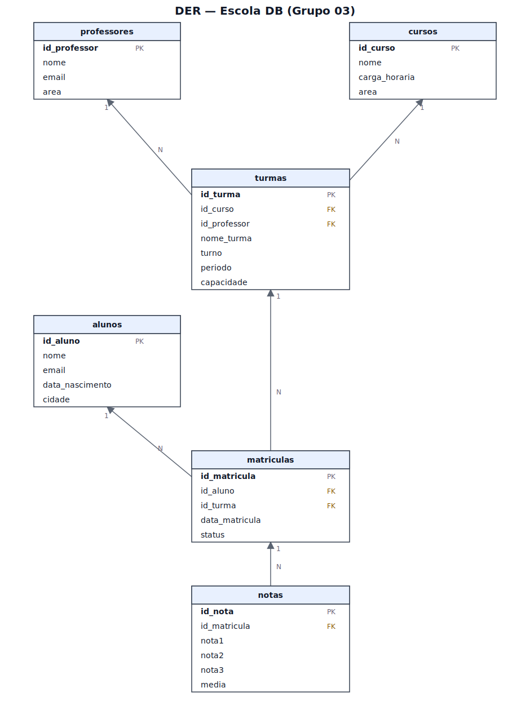

# DER — Escola DB

Diagrama gerado a partir de [`../sql/schema.sql`](../sql/schema.sql), com as
6 tabelas e seus relacionamentos:

- `turmas` → N:1 com `cursos` e `professores`
- `matriculas` → N:1 com `alunos` e `turmas`
- `notas` → N:1 com `matriculas`

O arquivo [`der-schema.dbml`](der-schema.dbml) é a fonte do diagrama — cole
em [dbdiagram.io](https://dbdiagram.io/) se quiser reeditar visualmente ou
gerar um PNG.
